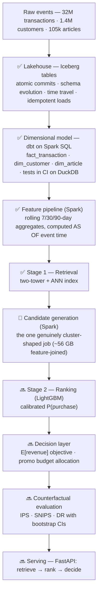

## Overview

**PromoRank** is a retail personalization system built end to end: a
point-in-time-correct feature pipeline on **Spark + Iceberg + dbt**, two-stage
**retrieval and ranking** over the H&M dataset (32M transactions · 1.4M
customers · 105k articles), and a **budget-constrained promotion policy** on
top — evaluated off-policy with confidence intervals instead of stopping at
NDCG.

Most portfolio recommenders stop at the ranker and report a ranking metric.
Stopping there means the system never makes a decision, so there is nothing to
evaluate causally and no business quantity to move. The chain
*model → decision → counterfactual evaluation of that decision* is the shape of
actual marketplace ML work, and each link requires the one before it.

<strong>Status: in progress</strong> — data platform and retrieval built, ranker and decision layer next. Last updated 2026-08-26.

<a class="btn btn-sm btn-outline-primary" href="https://github.com/RuiyanH/promorank" target="_blank" rel="noopener">GitHub repo</a>
<a class="btn btn-sm btn-primary" href="/marketrank-workbench/">Open historical workbench</a>

The public workbench is a static, de-identified demonstration of the complete
five-source historical artifact. It exposes eight demo views and reports the
reproducible full-cohort candidate recall ceiling of **10.78%** as of
2020-08-12. It is not a live recommender, trained ranker, or business-uplift
claim. The 11.93% result discussed below belongs to a separate experimental
configuration, not the public workbench release.

## Honest framing, up front

Three facts shape every number below, and they are stated before the pitch
rather than after it:

- **H&M is a single retailer, not a two-sided marketplace.** There are no
  sellers and no matching problem. The honest description is retail
  personalization + promotion allocation.
- **Prices are scaled, not currency.** Every revenue figure is relative —
  "+x% expected revenue at equal relevance," never a dollar amount.
- **There is no logged experiment and no logging policy.** Transactions are
  whatever the existing system surfaced, with no recorded propensities — which
  governs the entire causal-evaluation layer.

## Architecture

✅ built · 🔧 in progress · 🔜 planned

## The data platform

The scale is not where it looks. 32M raw transactions is medium data; the
genuine fan-out is downstream, in the feature backfill (rolling aggregates at
three window lengths, recomputed as-of every event timestamp) and in candidate
generation, where every training positive expands to N retrieved candidates
joined to point-in-time features — tens of gigabytes of feature-joined rows.
Spark is there because of the join fan-out, not the source table.

**Point-in-time correctness is the centerpiece.** Every feature is computed
from only what was knowable at the transaction's timestamp; get this wrong and
the ranker looks excellent offline and collapses in serving. It is also where a
real bug was caught: features were first built without a spine, leaving 85.6%
of candidate rows joining to NULL customer features — found by an audit,
rebuilt, and now guarded by a test.

Other things this layer does deliberately: idempotency defined over *business
content* rather than bytes (pipeline metadata like `_ingested_at` is excluded
from the re-run comparison), schema evolution used for a reason rather than as
a demo, and the same dbt project running on DuckDB in CI so tests are free and
fast.

## Retrieval: the honest story

The first measured two-tower **lost to a popularity baseline** — recall@100 of
5.53% vs 6.97% on an identical 20,000-customer cohort. Rather than tuning
blindly, the recovery was run as a ladder of cheapest-information-first
experiments, with tests written before any compute was spent:

| Measurement | Recall |
|---|---|
| Popularity baseline union (recall@100) | 6.97% |
| Two-tower, first build (recall@100) | 5.53% |
| Original candidate-set ceiling | 7.48% |
| **Shipped candidate-set ceiling, after recovery** | **11.93%** |

Two findings drove the recovery. First, the feature-spine bug above sat
upstream of the evaluation and had to be killed as a confound before any model
conclusion was valid. Second, the single biggest lever wasn't architecture at
all: a logQ-correction ablation on the negative sampler moved recall@500 by
**17×** (11.22% vs 0.67%) — with the *worse* model holding the *better*
training loss. On fast-fashion data, short-horizon signal is trend rather than
item identity (exact-article repurchase ceiling 3.4% vs 64.3% at product-type
level), so the article tower was given the same recent-volume information the
baseline sees.

The decision log — including why the tower ships as one candidate source
rather than the only one — is in
[`docs/STAGE1_RECOVERY.md`](https://github.com/RuiyanH/promorank/blob/main/docs/STAGE1_RECOVERY.md).

## Roadmap

- [x] Iceberg lakehouse with idempotent, re-runnable loads
- [x] dbt dimensional model + tests, DuckDB in CI
- [x] Point-in-time feature pipeline (7/30/90-day windows)
- [x] Two-tower retrieval + recovery ladder
- [ ] Candidate generation at full scale on a Slurm allocation (in progress)
- [ ] LightGBM ranker — NDCG, AUC, calibration
- [ ] Expected-revenue promotion allocation under budget
- [ ] Off-policy evaluation (IPS / SNIPS / DR) with bootstrap CIs
- [ ] FastAPI serving path with latency percentiles

## Links

[Repository](https://github.com/RuiyanH/promorank) ·
[Implementation guide](https://github.com/RuiyanH/promorank/blob/main/docs/IMPLEMENTATION.md) ·
[Retrieval recovery log](https://github.com/RuiyanH/promorank/blob/main/docs/STAGE1_RECOVERY.md)
